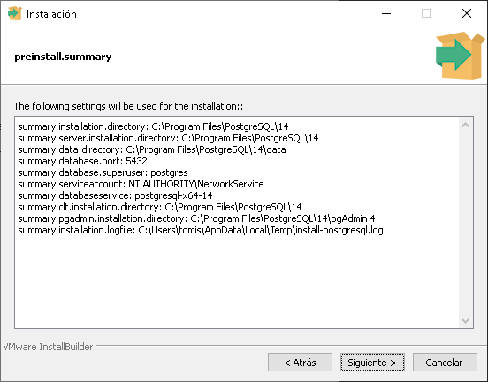

# **IMPRENTAGES**

<b>**ImprentaGes**&nbsp;</b>es una aplicación para Windows que permite gestionar ordenes de trabajo, boletas, facturas, productos, cajas, usuarios, permisos de acceso, etc.

Fue pensada para ser usada en imprentas, pero eso no impide que se pueda usar en otro tipo de negocio (Nota: la aplicación no implementa facturación electrónica).

Se desarrollo usando Java 1.8 y PostgreSql. Y se distribuye libremente como 3 proyectos de netbeans 8.2: ImprentaGes (La aplicación), KreadiJDBC (Utilidades para acceder a bases de datos) y KreadiSwing (Utilidades para las interfaces Java Swing).
 
## **INSTALACIÓN DE BASE DE DATOS POSTGRESQL**

Descargar y ejecutar el instalador de postgreSQL para Windows desde [<u><u>https://www.enterprisedb.com/downloads/postgres-postgresql-downloads</u></u>](https://www.enterprisedb.com/downloads/postgres-postgresql-downloads)

---

1.Presionar Siguiente.

---

2.Seleccionar la carpeta de instalación y presionar Siguiente.

---

3.Seleccionar PostgreSQL Server, seleccionar pgAdmin4, Command Line Tools y presionar Siguiente.

---

4.Seleccionar la carpeta donde se guardaran los datos y presionar siguiente.
 

---

5.Ingresar la contraseña del superusuario y presionar siguiente.

---

6.Ingresar el puerto desde donde se accede a la base de datos y presionar Siguiente.
 

---

7.Seleccionar la configuración regional por defecto y presionar siguiente.

---

8.Verificar los parámetros de instalación y presionar siguiente.

---

9.Presionar siguiente para instalar.

---
 
## **HABILITAR ACCESO A IP LOCALES**

En la carpeta donde se almacenan los datos (4). debe editar el archivo pg\_hba.conf para indicar desde cuales ip locales pueden acceder a la base de datos, por defecto solo se tiene acceso desde la misma maquina osea 127.0.0.1.

---

## **PRUEBA DE ACCESO A LA BASE DE DATOS**

pgAdmin es el cliente por defecto por defecto de PostgreSql para acceder a los datos.

---

Buscar la aplicación y ejecutar pgAdmin.

 

---

Nos pedirá configurar una clave(password) para acceder de forma segura a pgAdmin, ingrese la clave y presione OK.

---

Presionar en “Add New Server” para registrar un nuevo servidor de base de datos y seleccionar un nombre para dicho servidor.

---

Cambiar a la pestaña “connection”, ingresar la ip 127.0.0.1 en el “Host Name/Address”, ingresar la clave que configuro en 5) y presione Save.

---

Desde esta aplicación en databases se debe crear la base de datos <b>**impges**</b>. Después mediante esta misma aplicación se puede hacer respaldo y restauración de la base de datos.

 

---
 
## **EJECUTAR LA APLICACIÓN**

Para ejecutar la aplicación necesita tener instalado Java 1.8, el ejecutable para Windows esta en ImprentaGes/portables/ImprentaGes.exe

También se puede ejecutar la aplicación directamente netbeans, pero tiene que tener los 3 proyectos abiertos: ImprentaGes, KreadiJDBC y KreadiSwing.

---

### **¿COMO USAR IMPRENTAGES?**
 
Cuando ingrese la primera vez deberá realizar la configuración inicial.

Si la base de datos esta en otro equipo debe indicar la ip de ese equipo en **Servidor**, en **Clave** debe ingresar la que configuro en (5) y en **Caja** debe indicar caja1 inicialmente.

---

Luego deberá autenticarse. Inicialmente puede usar la cuenta de administración que tiene usuario admin y clave vacía.

--

A continuación se muestran las ventanas de aplicación y se explican los componentes de estas ventanas.
 
##### **VENTANA PRINCIPAL**

1. Gestión de ordenes de trabajo (OT), boletas y facturas.
2. Gestión de la caja.
3. Gestión de precios/productos.
4. Configuración general.
5. Información de la hora de acceso, el usuario y la caja.
6. Gestión del acceso.
7. Búsqueda por fechas, nombre, rut, numero de OT, numero de boleta, numero de factura. También permite realizar auditoria de movimientos entre fechas y auditoria con búsqueda de texto. También permite visualizar un resumen diario de los movimientos por cada caja.
8. Filtro de documentos terminados, pendientes o anulados.
9. Botón para ejecutar la búsqueda.
10. Resultados de la búsqueda que pueden ser exportados a Excel.

---
 
##### **PANTALLA DE CONFIGURACIÓN**

1. Selección del tipo de documento.
2. Edición del formato de impresión del documento.
3. Renombrar el tipo de documento.
4. Crear un nuevo tipo de documento.
5. Eliminar un tipo de documento.
6. Configuración de otros parámetros: números automáticos, números iniciales, formatos de fecha/hora, IVA, cantidad de registros.
7. Username del usuario.
8. Nombre real del usuario.
9. Correo del usuario.
10. Teléfonos del usuario.
11. Permiso para editar Precios/Productos.
12. Permiso para editar la configuración.
13. Permiso para gestionar la caja.
14. Permiso para gestionar OT, boletas y facturas.
15. Indica si el usuario esta activo.
16. Muestra los usuarios desactivados también.
17. Renombrar el usarname del usuario seleccionado.
18. Cambiar la clave del usuario seleccionado.
19. Crear un usuario nuevo.
20. Nombre de la caja.
21. Configuración de la impresora de facturas para la caja seleccionada.
22. Configuración de la impresora de boletas para la caja seleccionada.
23. Configuración de la impresora de OT para la caja seleccionada.
24. Configuración de la impresora de Informes para la caja seleccionada.
25. Lista de los usuarios que pueden accedera la caja seleccionada.
26. Indica si la caja esta activa.
27. Muestra las cajas desactivadas también.
28. Renombrar la caja seleccionada.
29. Agregar una nueva caja.

---
 
##### **CONFIGURACIÓN DE FORMATOS DE IMPRESIÓN**

1. Cantidad de caracteres de ancho del documento a imprimir.
2. Cantidad de caracteres de alto del documento a imprimir.
3. Código ascii de caracteres iniciales que se imprimirán.
4. Código ascii de caracteres finales que se imprimirán.
5. Texto que se imprimirá.
6. Posición actual del cursor.
7. Importar formato de impresión.
8. Exportar formato de impresión.
9. Guardar formato de impresión.

---
 
##### **GESTIÓN DE PRODUCTOS Y PRECIOS**

1. Guardar modificaciones.
2. Agregar un nuevo producto.
3. Multiplicar por un factor los productos seleccionados.
4. Clonar los productos seleccionados.
5. Ordenar alfabéticamente.
6. Exportar a Excel.
7. Eliminar los productos seleccionados.
8. Detalle de los productos.
9. Precios de los productos.

---
 
##### **GESTIÓN DE CAJAS**

1. Nombre del usuario autenticado que realizara la operación en la caja.
2. Nombre de la caja.
3. Fecha actual.
4. Turno diario de la caja (un turno ocurre entre la apertura y cierre de una caja).
5. Acciones: abrir caja, cerrar caja, ingresar dinero, retirar dinero.
6. Monto en efectivo al abrir caja y cerrar caja.
7. Monto en cheques al cerrar caja.
8. Monto en transferencias al cerrar caja.
9. Observaciones de la operación a realizar.
10. Cuadratura de dinero pagado.
11. Tipo de pagos(efectivo, cheques y transferencias).
12. Cantidad calculada de cada monto, que debe coincidir con lo contado al cerrar la caja.
13. Hora actual.
14. Botón para realizar la operación en la caja.
15. Edicion de orden de trabajo

---
 
##### **EDICIÓN DE OT, BOLETAS y FACTURAS**

1. Retroceder hacia la orden de trabajo anterior.
2. Numero de orden de trabajo.
3. Avanzar hacia la orden de trabajo siguiente.
4. Clonar o anular OT.
5. ESTADO
6. Estado de la OT: Pendiente (No pagada), Terminada (Pagada/impresa factura o boleta) o Anulada.
7. Numero de la boleta o Factura correspondiente.
8. Fecha de la solicitud de la OT.
9. Fecha de entrega de la OT.
10. Nombre del cliente.
11. Dirección del cliente.
12. Comuna del cliente.
13. Ciudad de cliente.
14. Detalle de la OT.
15. Observaciones sobre la OT.
16. Botón para pagar OT.
17. Botón para imprimir OT.
18. Total a pagar.
19. Ingreso de pagos.
20. Total a pagar.

--- 
 
##### VENTANA DE PAGOS

1. Cantidad total que debe pagar.
2. Saldo por pagar.
3. Cantidad ingresada a caja.
4. Cantidad que va a pagar.
5. Calculo del vuelto.
6. Tipo de pago: Efectivo, cheque o transferencia.
7. Numero de documento.
8. Banco.
9. Botón para ingresar un pago.
10. Detalle de los pagos realizados.
11. Guardar los pagos ingresados.

---
 
##### GENERACION DE FACTURAS Y BOLETAS A PARTIR DE LA OT

Cuando completa el pago se puede generar e imprimir la boleta o factura.

---

TODO LIST

SINCRONIZAR HORA Y FECHA CON EQUIPO SERVIDOR